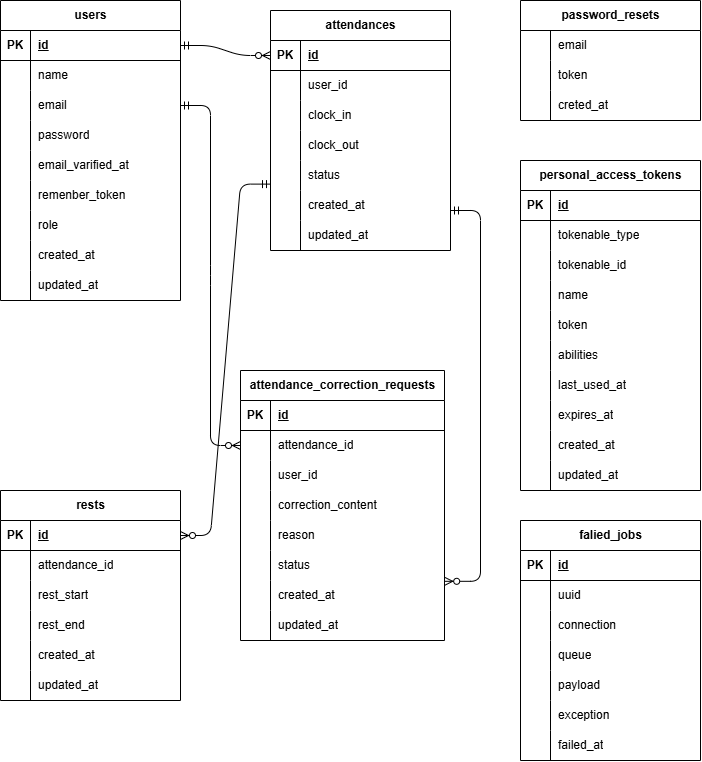

# 勤怠管理アプリケーション

## プロジェクト概要
```
本アプリケーションは、一般ユーザーによる勤怠打刻機能および管理者による勤怠管理機能を実装した勤怠管理システムです。
一般ユーザーは出勤・退勤・休憩などの打刻や修正申請を行い、管理者はスタッフ勤怠・修正申請を承認・確認できます。
```

## 使用技術一覧
```
フレームワーク	Laravel 8.75
PHPバージョン	8.0 以上
DB	MySQL 8.0
コンテナ構成	Docker / docker-compose
メール送信	Mailhog
認証	Laravel Fortify
テスト	PHPUnit 9.5
バリデーション	FormRequest
開発環境	Nginx / PHP-FPM / MySQL / Mailhog
```

## 環境構築手順
```
1. Docker コンテナ起動
docker-compose up -d
```
```
2. 依存パッケージのインストール
docker-compose exec php bash
composer install
```
```
3. 環境変数設定

.env がない場合は以下でコピーします：

cp .env.example .env
php artisan key:generate
```
```
Mailhogを利用しているため、.env 内は以下のようになっています：

MAIL_MAILER=smtp
MAIL_HOST=mailhog
MAIL_PORT=1025
MAIL_FROM_ADDRESS=example@test.com
```
```
ブラウザでメール受信を確認する場合：
👉 http://localhost:8025
```
```
4. マイグレーション & シーディング
php artisan migrate --seed

Seeder により、管理者アカウントが自動作成されます。
```

## 初期アカウント情報
```
管理者ユーザー
項目	内容
メール	admin@example.com
パスワード	password
備考	Seeder により自動作成（role=1）

※一般ユーザーは登録画面から新規登録可能です。
```
## アクセスURL
```
一般ユーザー ログイン	http://localhost/login
	Fortify標準
一般ユーザー 勤怠打刻	http://localhost/attendance
	出勤・退勤ボタン付き
管理者ログイン	http://localhost/admin/login
	管理画面専用ガード
phpMyAdmin	http://localhost:8080
	DB閲覧ツール
Mailhog	http://localhost:8025
	メール送信確認
```

## ルーティング一覧（主要画面）
```
【一般】勤怠打刻画面
/attendance	AttendanceController@index
【一般】	勤怠一覧	
/attendance/list	AttendanceController@list
【一般】	勤怠詳細	
/attendance/detail/{id}	AttendanceController@show
【一般】	修正申請一覧	
/stamp_correction_request/list	StampCorrectionRequestController@index
```
```
【管理者】	管理者ログイン	
/admin/login	AdminAuthController@showLoginForm
【管理者】	勤怠一覧	
/admin/attendance/list	AdminAttendanceController@index
【管理者】	スタッフ一覧	
/admin/staff/list	AdminUserController@index
【管理者】	修正申請一覧	
/admin/requests	AdminRequestController@index
```

## ER図



## メール認証（Mailhog使用）
```
Mailhog により、送信メールは実際には外部送信されず、
ローカル上で受信確認できます。

📍 アクセス先：http://localhost:8025

```

## テスト環境構築・実行手順
```
テスト用データベースの作成
docker-compose exec mysql bash
mysql -u root -p
# パスワード: root

CREATE DATABASE demo_test;
SHOW DATABASES;
exit;
```
```
テスト用の.envファイルの作成
cp .env .env.testing

その後、.env.testing を開き以下のように修正します
APP_ENV=test
APP_KEY=
DB_DATABASE=demo_test
DB_USERNAME=root
DB_PASSWORD=root
```

```
テスト用のテーブルの作成
docker-compose exec php bash
php artisan key:generate --env=testing
php artisan config:clear
php artisan migrate --env=testing
```
```
テストの実行
php artisan test
```

## トラブルシューティング

```
マイグレーションでエラーが起きた場合：
php artisan migrate:fresh --seed
を実行してデータベースをリセットし再構築してください
```
```
依存パッケージを変更したい・追加したい場合
composer install
こちらをPHPコンテナに入ってから実行してください
```
